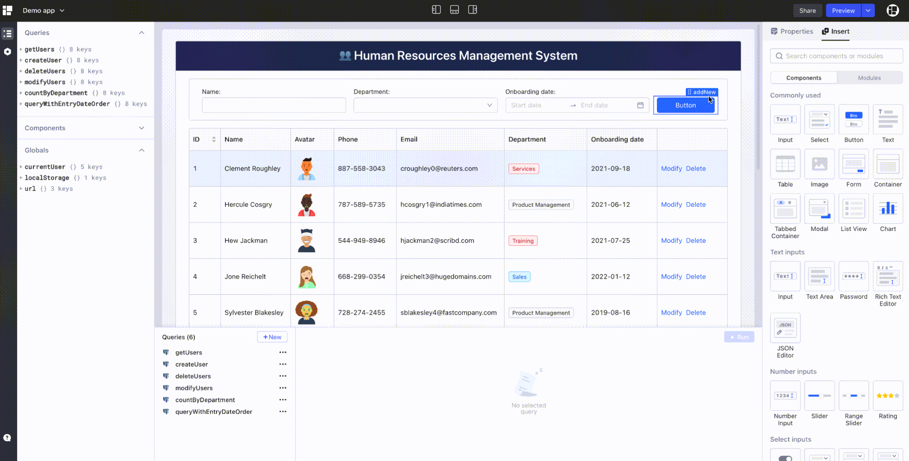

# Lowcoder CI/CD pipeline

Deploy Lowcoder server with CI/CD on Elestio

 
 

# Once deployed ...

To access `Admin Web UI`, first register with the credentials below:

    URL: https://[CI_CD_DOMAIN]/user/auth/register
    email: [ADMIN_EMAIL]
    password: [ADMIN_PASSWORD]

# Documentation

https://docs.lowcoder.cloud/
